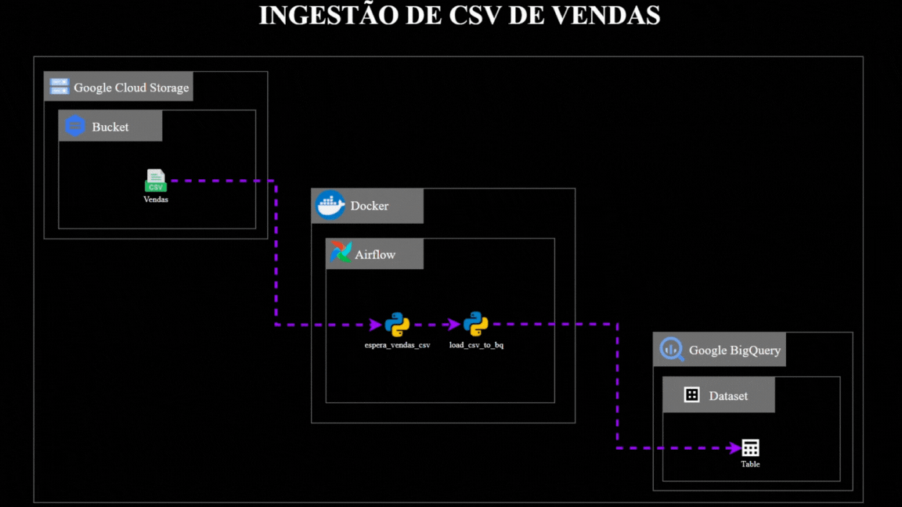

# *Ingestão de CSV de Vendas*

Olá a todos 👋, este repositório contém um projeto de ingestão de um arquivo CSV de vendas, simulando uma tarefa comum em diversos ambientes empresariais. O objetivo é possibilitar uma ingestão orquestrada e controlada, utilizando componentes da Google Cloud Platform (GCP). Você pode adaptar o projeto para realizá-lo em outros provedores de nuvem como a AWS ou AZURE, ou então realizar a orquestração dentro do próprio ambiente da Google Cloud Platform, substituindo o Airflow pelo Cloud Composer, por exemplo. Como se trata de uma ingestão simples para um projeto pessoal, optei por escolher ferramentas com baixo custo. Fique à vontade para adaptá-las como achar melhor!

---

## *Arquitetura do Projeto*



---

### **Configuração do Ambiente**

---

1. **Instalação**

Antes de começar, certifique-se de que você tem os seguintes itens instalados:

- **Docker**: [Instalação do Docker](https://docs.docker.com/get-docker/)
- **Docker Compose**: [Instalação do Docker Compose](https://docs.docker.com/compose/install/)
- **Conta no Google Cloud Platform (GCP)**: Crie uma conta [aqui](https://cloud.google.com/free).

---

2. **Configure os recursos na GCP:**
   - **Crie um bucket no Google Cloud Storage:**
     ```bash
     gcloud storage buckets create <nome-do-bucket> --location=us-central1
     ```
   - **Suba o arquivo `vendas.csv` no Bucket do Google Cloud Storage:**
     ```bash
     gcloud storage cp vendas.csv gs://<nome-do-bucket>
     ```
   - **Crie um dataset no Google BigQuery:**
     ```bash
     bq --location=US mk -d <nome-do-projeto>:<nome-do-dataset>
     ```
   - **Crie um acesso no IAM da Google Cloud:**
     ```bash
     gcloud iam service-accounts create <nome-do-acesso> \
       --description="Conta de serviço para ingestão de dados" \
       --display-name="Ingestão de Dados"
     ```
   - **Atribua as seguintes funções ao acesso:**
     ```bash
     gcloud projects add-iam-policy-binding <nome-do-projeto> \
       --member=serviceAccount:<nome-do-acesso>@<nome-do-projeto>.iam.gserviceaccount.com \
       --role=roles/bigquery.admin

     gcloud projects add-iam-policy-binding <nome-do-projeto> \
       --member=serviceAccount:<nome-do-acesso>@<nome-do-projeto>.iam.gserviceaccount.com \
       --role=roles/bigquery.dataEditor

     gcloud projects add-iam-policy-binding <nome-do-projeto> \
       --member=serviceAccount:<nome-do-acesso>@<nome-do-projeto>.iam.gserviceaccount.com \
       --role=roles/bigquery.user

     gcloud projects add-iam-policy-binding <nome-do-projeto> \
       --member=serviceAccount:<nome-do-acesso>@<nome-do-projeto>.iam.gserviceaccount.com \
       --role=roles/storage.objectAdmin

     gcloud projects add-iam-policy-binding <nome-do-projeto> \
       --member=serviceAccount:<nome-do-acesso>@<nome-do-projeto>.iam.gserviceaccount.com \
       --role=roles/storage.objectViewer
     ```
   - **Gere o arquivo `gcp-sa.json` com as credenciais de acesso:**
     ```bash
     gcloud iam service-accounts keys create gcp-sa.json \
       --iam-account=<nome-do-acesso>@<nome-do-projeto>.iam.gserviceaccount.com
     ```

3. **Configure o ambiente local:**
   - **Crie um arquivo `.env` na pasta do seu projeto com o seu ID de usuário:**
     ```bash
     AIRFLOW_UID=<Seu Id>
     ```
   - **Atualize o arquivo `docker-compose.yaml` com o caminho do arquivo `gcp-sa.json`.**
   ```yaml
        volumes:
          - ${AIRFLOW_PROJ_DIR:-.}/dags:/opt/airflow/dags
          - ${AIRFLOW_PROJ_DIR:-.}/logs:/opt/airflow/logs
          - ${AIRFLOW_PROJ_DIR:-.}/config:/opt/airflow/config
          - ${AIRFLOW_PROJ_DIR:-.}/plugins:/opt/airflow/plugins
          - <Substitua Aqui!>/gcp-sa.json:/opt/airflow/gcp/gcp-sa.json:ro
   ```

4. **Suba os serviços com Docker:**
   - Navegue até a pasta onde está o arquivo `docker-compose.yaml` e execute:
     ```bash
     docker compose up -d
     ```

5. **Configure o Airflow:**
   - Acesse o Airflow pelo navegador (geralmente em `http://localhost:8080`).
   - Em **Admin > Connections**, crie uma conexão chamada `google_cloud_default` com os seguintes parâmetros:
     - **Conn Type:** Google Cloud Platform
     - **Project Id:** Nome do seu projeto
     - **Key path:** `/opt/airflow/gcp/gcp-sa.json`
   - Salve a conexão.

6. **Execute a DAG no Airflow:**
   - No painel do Airflow, encontre a DAG chamada `sales_csv_to_bq`.
   - Ative e execute a DAG.

---

## **Considerações Finais**

Este projeto é uma base para ingestão de dados de CSV no BigQuery, utilizando o Airflow para orquestração e o Google Cloud Platform como provedor de nuvem. Adapte conforme necessário para atender às suas necessidades específicas. Se tiver dúvidas, sinta-se à vontade para abrir uma issue neste repositório.


- **dags/**: Contém os DAGs do Airflow.
- **logs/**: Diretório onde os logs do Airflow são armazenados.
- **plugins/**: Plugins personalizados para o Airflow.

